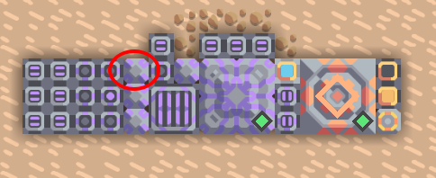
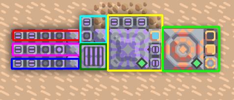
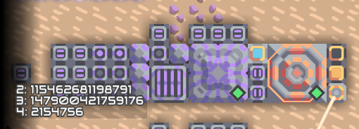
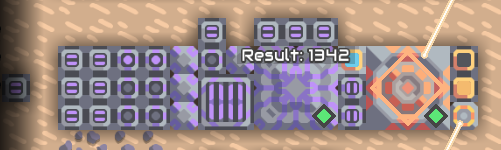
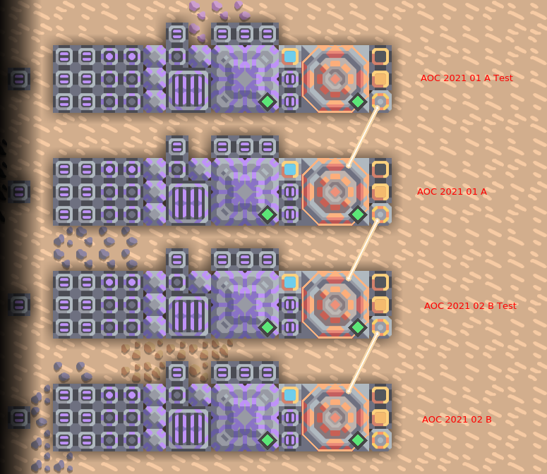

# Day 1

Input contains 2000 numbers, but a memory bank only has 512 cells. One solution is to create multiple memory banks. Another is to decode the 2000 numbers into 500 numbers by merging them into one number. I tried the second solution for fun.

The idea is to left shift the second, third and fourth number and merge them with bitwise "or" to they match into one number:

Example: 8, 16, 32, 64  
Bit repr: 0000000000001000, 0000000000010000, 0000000000100000, 0000000001000000  
Merged: 0000000001000000000000000010000000000000000100000000000000001000  
As int: 18014535949484040

This int will then be written into the memory cell and contains 4 numbers.

For this i needed to know how bit int/floats are in mindustry. To find this, i leftshifted the number 1 until the result will also be 1. This shows that the numbers in mindustry have 64 bit.

Then i have searched for the minimum and maximum number in the input to see how much bits i need for every number. All numbers are > 0 and < 8192, so they need at least 13 bit.

Now the idea was to leftshift numbers by 16*x, because then 4 numbers can be put into 64 bit.

During that another problem occurred. I though that the number in mindustry are either integers or floating numbers. But all numbers are represented as floating numbers. So i get into trouble with the above decoding. Because of floating point inaccuracy some values that are too high will be changed during write and read.

This is solved by only using the mantissa part of the floating number and don't use the exponent. The mantissa of a 64 bit float is 52 bit, so i can put 4 numbers into one mantissa by leftshifting 13 times.

The decoded input is written into `*_optimized`.

The i used the script [write_array_to_cell.py](https://github.com/Bergiu/AdvancedMindustryLogic/blob/main/aoc/write_array_to_cell.py) to create code that writes the numbers into a memory bank.

The input code is put into this processor. After that the left button is used to activate the processor and write the numbers into the memory bank.

The red box is used for input. The pink box is used for debugging. The blue box can be used for sorting and implements selection sort (which may be too slow) which isn't used in this task. The light blue box contains a randomizer, that inputs random numbers into the memory, which can be used for debugging. The yellow box is the main processor that runs our task code. The green box is a booster to improve the execution time by 2.5.

The debugger prints all numbers that are saved in the memory bank.

Now i have the numbers decoded in the memory bank and can start with the task. The program loops over all numbers in the memory and decodes them. `bit_block = ((2 ** 13) - 1)` creates a number with all zeros and 16 ones in the end. `val_i >> (shift * 13)` right shifts the current number with 13 multiplied by the current shift. The first decoded number in the number has `shift = 0`, the second `shift = 1` and so on. After that the shifted number is combined with the bit block with bitwise "and". This removes the part of the number that we don't need. Then we have decoded the number and can compare it.

The program is compiled to mindustry code and copied to clipboard with `main.py a.amnd|xclip -selection c` and than inserted into the big processor. `main.py` is the compiler from [advanced mindustry code](https://github.com/Bergiu/AdvancedMindustryLogic/blob/main/main.py).

After the program finished the result is displayed in the middle.

The picture shows all buildings. The first building block contains the test code from task a, the second contains the real code from a. The third contains the test code from b and the last contains the real code from b.

https://user-images.githubusercontent.com/13796963/144300412-5c3b674a-cc77-4b10-b380-4e854def41f5.mp4

