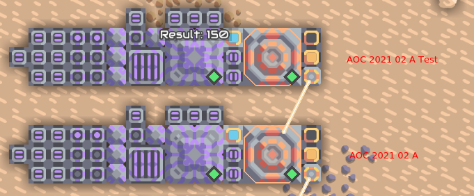
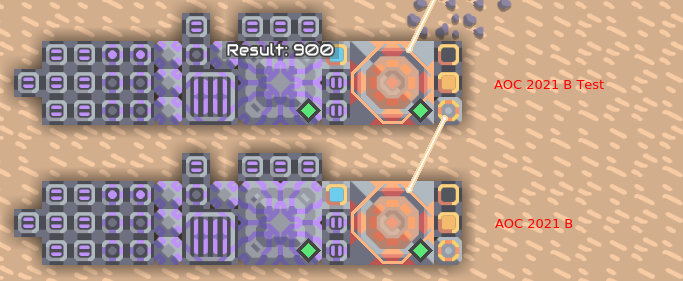

# Day 2

Today the input file contains 1000 lines and each line contains a string and a value between 0 and 9. The strings are either "forward", "up" or "down". Because it's not possible to save strings in a memory bank I wrote a script `convert_inputs.py` that converts "forward" to 1, "up" to 2 and "down" to 3. After that, the numbers are decoded with the script (modified) from day 1 to save 4 numbers in 1.

In mindustry I used the same schematic like on day 1. Also the decoding works the same.

