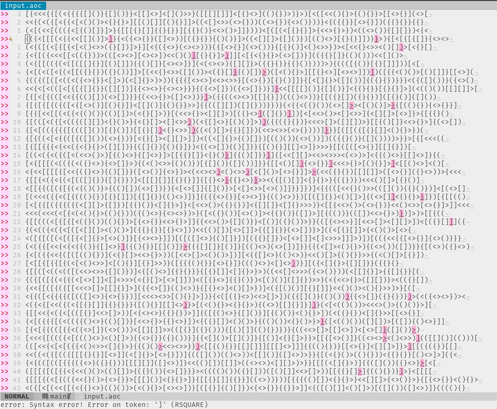

# Neovim Support

Required: Ale

First copy the filetype plugin: `cp ftdetect_aoc.vim ~/.config/nvim/ftdetect/aoc.vim`

Then copy the linter plugin into ale:
1. `mkdir ~/.nvim/plugged/ale/ale_linters/aoc`
2. `cp ale_aoc.vim ~/.nvim/plugged/ale/ale_linters/aoc`

Last: Save your input as `.ale` file and open it with neovim

