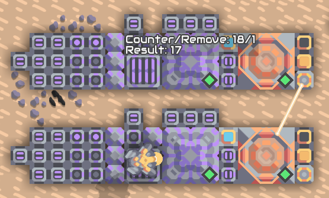
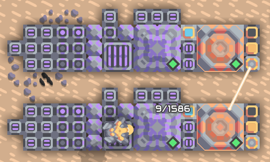

# Day 13

## Mindustry

### Part 1

I've implemented a solution for this. The test works and the real input is calculated within some seconds. But after the calculation the list must be counted and that needs to much time. It would need about 2.7h. The problem is, that the list may contain items two, three or more times. To calculate the real size without duplicates the current algorithm is O(n²). Currently I have no idea how to improve this.

